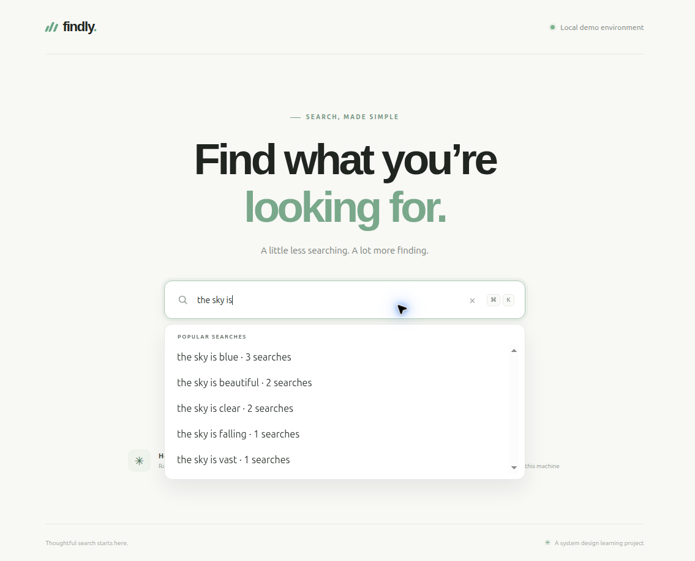

# Search Autocomplete System

An educational local MVP for query suggestions ranked by committed-search frequency. The system design is in [docs/system-design.md](docs/system-design.md), and evidence from local verification is kept in [docs/verification/](docs/verification/).

A complete document map is available in the [Documentation index](docs/README.md).

## Contents

- [What is included](#what-is-included)
- [Local prerequisites](#local-prerequisites)
- [Test and build](#test-and-build)
- [Deploy to local Kind](#deploy-to-local-kind)
- [OpenDesign workflow](#opendesign-workflow)
- [SonarQube and JEV](#sonarqube-and-jev)
- [Project structure](#project-structure)
- [Build, deploy, and use prerequisites](#build-deploy-and-use-prerequisites)
- [Undeploy](#undeploy)
- [Screenshots](#screenshots)
- [AI development disclaimer](#ai-development-disclaimer)

## What is included

- Vue 3 and TypeScript frontend with prefix suggestions, keyboard navigation, empty/loading/error states, and completed-query submission.
- Three Rust services: `suggestion-service`, `query-analytics-service`, and `index-builder-worker`.
- PostgreSQL schemas owned by analytics and index-builder contexts; a versioned snapshot loaded into the suggestion service's in-memory prefix index.
- Helm deployment for the existing local Kind cluster, with two replicas for each application Deployment and one PostgreSQL replica.
- Rust unit and PostgreSQL integration tests, Vue component tests, Playwright end-to-end tests, and SonarQube project configuration.

The local demo seeds synthetic example searches for prefixes `ru` and `the sky is`; other prefixes may correctly return no suggestions until matching completed searches have been recorded. The 100 ms goal and traffic estimates in the design are interview scenario assumptions, not measured local capacity or a production service level.

## Local prerequisites

Install Rust/Cargo, Docker, Kind, kubectl, Helm, Node.js 24+, and Corepack. The frontend lockfile was created with pnpm 10.33.2; use Corepack's pinned version:

```sh
cd web-frontend
corepack pnpm@10.33.2 install --frozen-lockfile
```

No real searches or credentials belong in this repository. The disposable chart uses PostgreSQL `trust` authentication inside the isolated Kind cluster so it needs no committed password. Do not expose that local cluster outside your machine.

## Test and build

```sh
cargo test --workspace
cd web-frontend
corepack pnpm@10.33.2 test
corepack pnpm@10.33.2 build
```

PostgreSQL integration tests need `TEST_DATABASE_URL` pointing to a separate test database. After deploying, port-forward the local PostgreSQL Service to port 5433, create `search_autocomplete_test`, and run:

```sh
kubectl exec -n search-autocomplete statefulset/postgres -- psql -U autocomplete -d postgres -c 'CREATE DATABASE search_autocomplete_test'
kubectl port-forward -n search-autocomplete service/postgres 5433:5432
# In another shell:
TEST_DATABASE_URL='postgres://autocomplete@127.0.0.1:5433/search_autocomplete_test' cargo test --workspace -- --nocapture
```

The integration suite never targets the demo database, keeping test revisions separate from the active autocomplete snapshot.

## Deploy to local Kind

The deployment script checks that the current context is `kind-kind`, builds the four application images, loads them into Kind, installs the Helm chart in `search-autocomplete`, and restarts the Deployments so they pick up refreshed local `dev` images:

```sh
./scripts/deploy-kind.sh
```

Check that all four application Deployments have two ready replicas:

```sh
kubectl get deployments -n search-autocomplete
kubectl get pods -n search-autocomplete
```

Serve the frontend locally and run browser acceptance tests against the whole deployed request path:

```sh
kubectl port-forward -n search-autocomplete service/web-frontend 4173:8080
# In another shell:
cd web-frontend
E2E_BASE_URL=http://127.0.0.1:4173 corepack pnpm@10.33.2 test:e2e
```

Open the app at [http://127.0.0.1:4173](http://127.0.0.1:4173). A local deployment screenshot is included in the screenshots section.

## OpenDesign workflow

OpenDesign was launched from its local source checkout with Corepack pnpm 10.33.2, and its agent selector was set to GPT-6-Luna. The Home workflow uses a native folder picker. This environment's UI automation could open the picker but could not interact with its native dialog, so `web-frontend` is not selected as the OpenDesign working directory. To complete that step, open OpenDesign Home, choose **Working directory → Choose folder**, and select this repository's `web-frontend` directory. The OpenDesign selector exposed no `max` reasoning-effort option.

## SonarQube and JEV

The four requested SonarQube project keys are listed in [`sonar-projects.md`](sonar-projects.md). In SonarQube, open a project and choose **Measures → Coverage** to view imported line and branch coverage. The scanner needs LCOV reports: Vitest creates the frontend report, and Rust coverage uses `cargo-llvm-cov`.

Latest local SonarQube overall coverage is above 80% for every project: frontend 83.5%, suggestion service 100.0%, query analytics 100.0%, and index builder 99.2%. See [`docs/verification/sonarqube.md`](docs/verification/sonarqube.md) for line/branch measures, quality gates, and the coverage denominator details.

Install the coverage tool once with `cargo install cargo-llvm-cov --version 0.9.1`. With the existing authorized `SONAR_TOKEN` in the environment, run `./scripts/sonar-scan.sh` to execute the coverage tests, generate LCOV reports, and analyze each project. Set `TEST_DATABASE_URL` to the separate test database described above when running the Rust coverage suite so PostgreSQL integration tests are included. Coverage output is generated locally and ignored by Git. Never commit tokens or create replacement credentials. Results and measures are recorded in `docs/verification/sonarqube.md`.

The JEV rubric, probability distribution, confidence, model, date, and evidence scope belong in `docs/verification/jev-readiness.md`. JEV is advisory and is not a release gate. Its input must contain sanitized design and test evidence, not source code, credentials, or raw query data.

## Project structure

```text
web-frontend/             Vue user interface
suggestion-service/       prefix matching and in-memory index
query-analytics-service/  committed-query events and frequency aggregates
index-builder-worker/     versioned snapshots from analytics aggregates
deploy/helm/              local Kubernetes resources
docs/                     system design and verification evidence
```

Each service owns its `README.md` and `AGENTS.md`. Follow Conventional Commits 1.0.0 for commit messages.

## Build, deploy, and use prerequisites

- **Build and deploy:** Rust/Cargo, Docker, Kind, kubectl, Helm, Node.js 24+, and Corepack with pnpm 10.33.2.
- **Use:** a ready local Kind release, a browser, and the loopback frontend port-forward. Demo suggestions use synthetic data.

## Undeploy

Stop the frontend port-forward with Ctrl-C and remove the release:

```sh
helm --kube-context kind-kind uninstall search-autocomplete --namespace search-autocomplete
```

The chart retains its PostgreSQL PVC. Do not delete the namespace or PVC if the local database must be preserved. Per-container CPU and memory requests and limits are recorded in [Kubernetes resource budgets](docs/kubernetes-resources.md).

## Screenshots




## AI development disclaimer

> **AI development disclaimer:** This project was built entirely with GPT-6 Luna at Max effort as a proof of concept exploring how low-cost AI plans can be useful when paired with disciplined harness and loop engineering. This is project-owner attribution; repository contents do not independently verify runtime model metadata. Review AI-generated design and code before relying on them.
