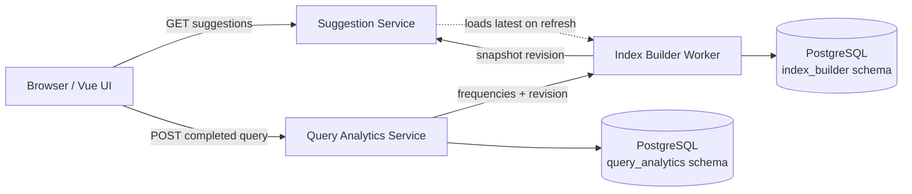
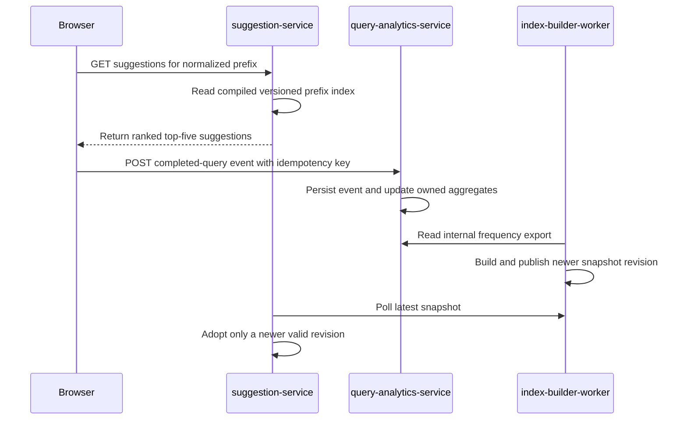

# Search Autocomplete System — System Design

**Status:** educational local MVP design
**Date:** 2026-09-24
**Scope:** Vue 3 web client, three Rust backend services, and one PostgreSQL instance in a local Kind cluster.

> Project documentation index: [Documentation index](README.md)

> Project decision records: [ADR index](adr/README.md).

> Database tables, columns, and ownership: [Database model](database-model.md).

## Contents

- [1. Abstract](#1-abstract)
- [2. Goals and non-goals](#2-goals-and-non-goals)
- [3. Background, assumptions, and constraints](#3-background-assumptions-and-constraints)
- [4. Domain and bounded contexts](#4-domain-and-bounded-contexts)
- [5. Proposed architecture and request paths](#5-proposed-architecture-and-request-paths)
- [6. Lifecycle and consistency](#6-lifecycle-and-consistency)
- [7. APIs and data contracts](#7-apis-and-data-contracts)
- [8. Data model](#8-data-model)
- [9. Failure handling and operations](#9-failure-handling-and-operations)
- [10. Security and privacy](#10-security-and-privacy)
- [11. Alternatives and trade-offs](#11-alternatives-and-trade-offs)
- [12. Open questions and next decisions](#12-open-questions-and-next-decisions)
- [13. Decisions and acceptance cases](#13-decisions-and-acceptance-cases)
- [References and traceability](#references-and-traceability)

## 1. Abstract

This design describes a search autocomplete system that returns up to five popular completed queries matching the beginning of the typed prefix. A submitted search contributes to future popularity ranking. The browser calls a stateless suggestion API; that service reads a versioned trie snapshot held in memory. A separate analytics service owns committed-query frequencies, and an index builder periodically converts those aggregates into an immutable snapshot.

The design follows the problem framing in [ByteByteGo's Search Autocomplete System chapter](https://bytebytego.com/courses/system-design-interview/design-a-search-autocomplete-system): return a small number of popular prefix matches quickly, with a 100 ms target. The traffic estimates below are interview scenario assumptions. The local Kind deployment is an educational functional MVP and is not presented as having the chapter's capacity or latency.

## 2. Goals and non-goals

### Goals

- Return no more than five suggestions that start with the normalized prefix.
- Rank by committed-query frequency descending, then query text ascending for deterministic ties.
- Record only completed searches, with a caller-provided idempotency key.
- Keep analytics data, index snapshots, and online serving in separate bounded contexts.
- Preserve the last valid in-memory suggestions when the snapshot endpoint is temporarily unavailable.
- Run the frontend and each backend as a separate Kubernetes Deployment with two replicas in local Kind.
- Make the request path, data flow, and verification evidence reproducible from the repository.

### Non-goals

- Spell correction, personalized ranking, trending windows, multilingual text, unsafe-content filtering, or mobile clients.
- A queue, Redis, distributed search engine, or cross-region consistency.
- Production identity, privacy review, SLO commitment, capacity sizing, or high availability for PostgreSQL.
- Claiming that local test traffic proves production-scale capacity.

## 3. Background, assumptions, and constraints

### Problem and working assumptions

- The client issues suggestions while the user types; a search event is recorded only when a query is selected or submitted with Enter.
- English ASCII letters and spaces are in scope. Inputs are lowercased, trimmed, and internal whitespace is collapsed.
- A normalized query is at most 50 characters. Only `a-z` and spaces are accepted. Prefix matching is exact and at the beginning of the completed query.
- Empty prefixes are valid and yield no suggestions. Invalid non-empty prefixes receive HTTP 400.
- Suggestion ranking reflects all successfully committed query events in the local educational database.
- Two replicas are used to exercise stateless application deployments. PostgreSQL has one local replica and is a single failure point.

### Workload scenario from the interview prompt

The chapter's example assumes 10 million daily active users, 10 searches per day, 20 characters typed per search, about 24,000 average queries per second, and roughly double that at peak. Its approximate 0.4 GB/day query-data figure is also an interview estimate. These values are planning context for the exercise only; no local benchmark or infrastructure claim is derived from them.

### Latency target

The chapter's suggested response target is less than 100 ms for autocomplete. The MVP keeps the online path small by serving the prefix index from process memory. It does not yet include a load test or measured p95/p99 latency. The target is therefore a design objective, not a verified SLO.

## 4. Domain and bounded contexts

| Bounded context | Owns | Responsibilities |
|---|---|---|
| Search Suggestions | In-memory prefix index | Normalize a prefix, match from the start of a query, return its first five ranked terms, refresh to newer snapshots |
| Query Analytics | `query_analytics` schema | Accept completed-query events, deduplicate idempotency keys, maintain query frequencies and a monotonic revision |
| Search Index Building | `index_builder` schema | Read a consistent aggregate view from analytics, persist immutable revisioned snapshots, expose the latest snapshot |
| Web Search | Browser state | Collect text, show suggestion and request states, support keyboard selection, submit completed searches |

The aggregates are deliberately simple. Query analytics uses a query frequency as its aggregate root and a service-level revision to describe the source state. Index building owns a snapshot aggregate keyed by revision. No cross-service transaction is required: each analytics commit advances the revision, and the worker publishes a snapshot for that revision later.

## 5. Proposed architecture and request paths



The two schema boxes are in one PostgreSQL instance for the local environment. Ownership is service-level; analytics does not write index snapshots, and the index worker does not update query events or frequencies.

### Logical components

- **web-frontend:** Vue 3 + TypeScript, built as static assets and served by Nginx. Nginx routes the two public API paths to their owning services.
- **suggestion-service:** Rust + Axum. Holds a compiled prefix-to-top-five map in an `RwLock`, refreshed from the index builder's internal latest-snapshot endpoint. The last successfully loaded revision remains active if a later request fails.
- **query-analytics-service:** Rust + Axum + SQLx. Owns public query-event submission, internal aggregate reads, and its schema migrations.
- **index-builder-worker:** Rust + Axum + SQLx. Polls query analytics every 15 seconds in the local profile, writes snapshots idempotently by source revision, and serves the latest stored snapshot to the suggestion service.
- **PostgreSQL:** One StatefulSet replica with a persistent local volume. It is intentionally not a production HA design.

### Request path: a suggestion

1. The UI sends `GET /api/v1/suggestions?prefix=ru` as the text changes.
2. The suggestion service normalizes and validates the prefix.
3. The service looks up the exact prefix in its in-memory index.
4. It returns up to five terms ordered by frequency descending, then lexical order.

### Data path: a completed search

1. Selecting a result or pressing Enter submits `POST /api/v1/query-events` with the completed query and an idempotency key.
2. Analytics normalizes the query and, in one PostgreSQL transaction, inserts the unique event, increments its frequency only on a new key, and advances the source revision.
3. The worker polls the internal frequency API, then stores a JSON snapshot with the matching revision. A duplicate snapshot revision is a no-op.
4. Suggestion replicas periodically request the worker's latest snapshot. Each accepts only a newer revision and compiles it in memory.
5. Suggestions reflect an accepted snapshot after asynchronous refresh; this is eventual consistency. An unavailable worker does not erase the online service's last good index.

## 6. Lifecycle and consistency

- The query-event insert, frequency increment, and revision bump share a transaction. A unique idempotency key prevents a retried HTTP submission from counting twice.
- The event's idempotency key is currently retained without expiry in the local table. Production retention and privacy requirements are an explicit open question.
- The worker reads all current aggregate rows alongside one analytics revision. It persists a snapshot whose revision is that source revision.
- `index_builder.snapshots.revision` is the primary key. The same revision cannot be written twice; builders polling in parallel converge on one record.
- The suggestion service never replaces an active index with an older or equal revision. A failed load leaves the current in-memory index available.
- The refresh period in the local profile is 15 seconds for index building. Suggestion replicas poll the latest snapshot every 5 seconds so newly published snapshots become visible promptly.
- On first startup, an empty snapshot returns no suggestions until synthetic local seed events have been aggregated and built. The local sample includes the prefixes `ru` and `the sky is`; seed event IDs are fixed and idempotent.




## 7. APIs and data contracts

### Public: suggestions

`GET /api/v1/suggestions?prefix={text}`

| Case | Result |
|---|---|
| Valid non-empty prefix | `200` with normalized prefix and up to five suggestions |
| Empty or whitespace-only prefix | `200` with an empty suggestion list |
| Invalid characters or more than 50 normalized characters | `400` with an error message |

Example response:

```json
{
  "prefix": "ru",
  "suggestions": [
    { "query": "rust", "frequency": 3 },
    { "query": "rust web", "frequency": 2 },
    { "query": "rust async", "frequency": 1 }
  ]
}
```

### Public: completed query event

`POST /api/v1/query-events`

```json
{ "query": "Rust  web", "idempotency_key": "browser-generated-unique-value" }
```

The service normalizes this example to `rust web`; a new event returns `202` with `accepted: true` and the resulting revision. A duplicate key is accepted as an idempotent replay without another frequency increment. Empty queries, invalid characters, and queries longer than 50 normalized characters are rejected with HTTP 400.

### Internal contracts

- `GET /internal/v1/frequencies` on analytics returns a source revision and the current list of `{term, frequency}` values.
- `GET /internal/v1/snapshots/latest` on index builder returns `{revision, terms}`; it returns 404 before the first snapshot.
- All services expose `GET /healthz` for Kubernetes probes. Internal APIs are cluster-only in this local deployment; production authentication is not implemented.


### Contract ownership and consumers

| Interface | Owner | Producer | Known consumers by repository/component | Authority |
| --- | --- | --- | --- | --- |
| Suggestions REST API | `search-autocomplete-system` / `suggestion-service` | `suggestion-service` | Same repository: `web-frontend`; other-repository consumers: unknown | `suggestion-service/` and this design |
| Completed-query event intake | `search-autocomplete-system` / `query-analytics-service` | `web-frontend` submits completed queries | Same repository: `query-analytics-service`, then `index-builder-worker` via analytics data; other-repository consumers: unknown | `query-analytics-service/` and this design |
| Internal frequency export | `search-autocomplete-system` / `query-analytics-service` | `query-analytics-service` | Same repository: `index-builder-worker`; other-repository consumers: unknown | `query-analytics-service/` and this design |
| Latest suggestion snapshot | `search-autocomplete-system` / `index-builder-worker` | `index-builder-worker` | Same repository: `suggestion-service`; other-repository consumers: unknown | `index-builder-worker/` and this design |

See the [contract catalog](contracts/README.md) for data ownership and compatibility.

## 8. Data model

### Query analytics schema

| Table | Key fields | Purpose |
|---|---|---|
| `query_events` | `idempotency_key` PK, `normalized_query`, `recorded_at` | Prevent double-counting on retries and keep local event evidence |
| `query_frequencies` | `normalized_query` PK, positive `frequency` | Aggregate completed searches by normalized term |
| `service_state` | singleton key, `revision` | Monotonic source revision incremented with each novel event |

### Index builder schema

| Table | Key fields | Purpose |
|---|---|---|
| `snapshots` | `revision` PK, `snapshot` JSONB, `created_at` | Immutable versioned serving payload. The greatest revision is the latest snapshot. |

The local schema has no expiration or compaction yet. With a 15-second build interval and persistent history, a long-running installation can accumulate snapshots; local cleanup is a manual reset for now. A production design would define retention, snapshot compression, and rollout policy before it ran continuously.

## 9. Failure handling and operations

- **Suggestion service cannot load a snapshot:** retain the in-memory revision, log the failed refresh, and continue serving it.
- **Index builder cannot read analytics or write PostgreSQL:** keep the last persisted snapshot, log the error, and retry on the next poll.
- **Analytics cannot reach PostgreSQL:** return 503 from health checks and 500 for an event that could not be saved; the UI reports that the search was not recorded.
- **One application replica fails:** Kubernetes replaces it. The other replica serves traffic; startup refreshes it from the latest persisted snapshot.
- **PostgreSQL is unavailable:** event recording, new snapshot builds, and database readiness fail. The suggestion service can keep answering from an already loaded snapshot, but initial or new replicas may have no snapshot yet.
- **Observability:** structured request logs and health endpoints are present. Metrics, distributed tracing, alerting, backups, and operational dashboards are future work.
- **Local reset:** deleting the namespace removes its persistent volume claim and the demo data. This is intended for the disposable educational Kind environment only.


### Resource budgets and Kubernetes practice

Every pod template has CPU and memory requests and limits for each regular and init container. The concrete local values are maintained in [Kubernetes resource budgets](kubernetes-resources.md); they are local defaults, not measured consumption or production sizing. Measure representative workloads in the target environment, set requests for observed baseline needs and limits for acceptable bursts, then monitor CPU throttling, memory pressure, and OOM events and adjust deliberately.

## 10. Security and privacy

- Query values are user-originated text. The local browser posts only after an explicit selection or Enter action; keystrokes are not written to analytics.
- The chart uses PostgreSQL `trust` authentication within the isolated local Kind network to avoid a committed development password. Do not expose this deployment outside the local machine.
- The sample searches are synthetic. No secret, token, real search history, or personal data is included in test/evaluation evidence.
- Internal HTTP endpoints are reachable inside the cluster and are not authenticated in this educational profile. Network policies, service authentication, secret management, retention policy, and abuse controls are production prerequisites.
- No claims are made about encryption, compliance, or production handling of personal data.

## 11. Alternatives and trade-offs

| Choice | Why it fits this MVP | Trade-off / revisit when |
|---|---|---|
| Trie-like prefix map, precomputed top five per prefix | Simple and fast lookup for an educational, modest synthetic vocabulary | Memory grows with the number and length of terms; segment/shard or use a search engine if actual measurements require it |
| Periodic snapshot polling | Easy to reason about and needs no broker | Ranking changes are visible after a poll; a stream or change notification may be warranted if freshness is required |
| One Postgres instance, two owned schemas | Small local operational footprint while preserving logical ownership | Shared failure and resource contention; separate or HA data stores only with explicit production requirements |
| Static Nginx frontend with two API routes | Small local deployment and same-origin browser calls | A gateway or ingress can be introduced when routing, auth, or external access is in scope |
| No Redis or message broker | No current requirement justifies another stateful dependency | Revisit when measured load or event delivery requirements demonstrate the need |

The service split is the selected educational scope. At a small real deployment, a modular service may be cheaper to operate; any consolidation should preserve these data and domain boundaries.

### Architecture practice fit

DDD-lite is useful because analytics, index building, suggestion serving, and browser interaction have distinct language, data authority, and lifecycles. Keep policy and snapshot transformation in small modules with explicit inputs and outputs; do not add a generic Clean Architecture layer to simple HTTP/SQL paths. This system has one justified CQRS-style projection: analytics accepts completed-query writes, the builder materializes a versioned ranking snapshot, and the suggestion service serves an in-memory prefix index. Keep this projection and its 15-second freshness window; a broker, event store, or second serving database would add cost without an evidenced need. YAGNI, KISS, and DRY mean keeping one authoritative analytics schema and snapshot contract, with no shared abstraction that couples their owners.

## 12. Open questions and next decisions

- What retention window, deletion behavior, and privacy policy should apply to completed search data?
- Should popularity be lifetime frequency, a time-windowed score, or a decay-weighted score?
- What language and collation rules should replace the ASCII English MVP if more locales are required?
- What abusive or inappropriate-query moderation policy is needed before exposing suggestions publicly?
- What measured vocabulary size, update rate, p95 latency, and availability target would justify another index or data-store design?
- How should snapshot history be compacted and how should the system recover after a full database loss?

## 13. Decisions and acceptance cases

The local MVP uses the selected Rust backends and Vue client, one local PostgreSQL instance, 2 replicas per application Deployment, 15-second index polling, and no queue or external cache dependency. The index builder's immutable snapshot and the suggestion service's in-memory prefix index are the narrow read projection needed to keep suggestions off the analytics write path. This is CQRS-style read optimization, not a full CQRS platform: analytics remains the write authority, the projection is rebuilt from its revisioned aggregate view, and no broker, event store, or separate serving database is used.

| ID | Given | When | Then | Evidence |
|---|---|---|---|---|
| AC-01 | A snapshot contains more than five terms for `ru` | The client requests prefix `ru` | At most five results are returned in frequency/lexical order | Suggestion unit and API tests; Kind acceptance |
| AC-02 | The client enters mixed case and repeated spaces | It requests suggestions | The prefix is lowercased and spaces are collapsed | Normalization tests |
| AC-03 | Prefix is empty or has invalid characters | It requests suggestions | Empty gets zero results; invalid input gets 400 | API tests |
| AC-04 | A new completed query is submitted twice with one key | Analytics persists both requests | Frequency and revision increase only once | PostgreSQL integration test |
| AC-05 | Two workers persist the same revision | They save a snapshot | Exactly one row represents the revision and can be loaded | PostgreSQL integration test |
| AC-06 | A user types a prefix and navigates by keyboard | They select and submit a suggestion | The chosen completed query is recorded with an idempotency key | Playwright and local Kind acceptance |
| AC-07 | No terms match / the suggestion endpoint fails | The UI displays the response | Empty and error states are understandable and usable | Component and Playwright tests |
| AC-08 | A local application Deployment is installed | Kubernetes converges | Each of four application Deployments reaches 2/2 ready replicas | `kubectl rollout status` and verification log |

This evidence-oriented workflow follows [AI system design documents](https://marcelomiyake.com.br/posts/ai-system-design-documents/) and [spec-driven development](https://marcelomiyake.com.br/posts/spec-driven-development/): define observable acceptance cases, then keep test and environment results traceable in the verification record.

## References and traceability

- [API/data contract catalog](contracts/README.md) — owners, producers, consumers, and implementation links.
- [Verification index](verification/README.md) — recorded local evidence and the commands that produced it.
- [Kubernetes resource budgets](kubernetes-resources.md) — CPU/memory requests and limits for all pod containers.
- Component implementation and migrations are linked from the contract catalog; update this design when a behavior or ownership boundary changes.
